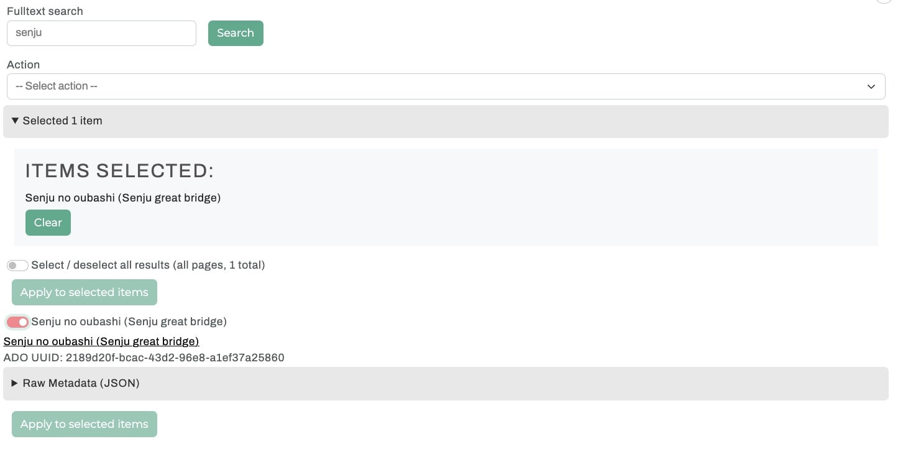
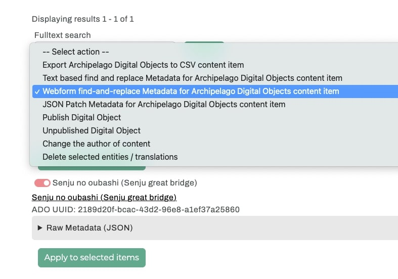
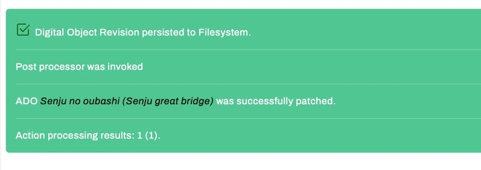
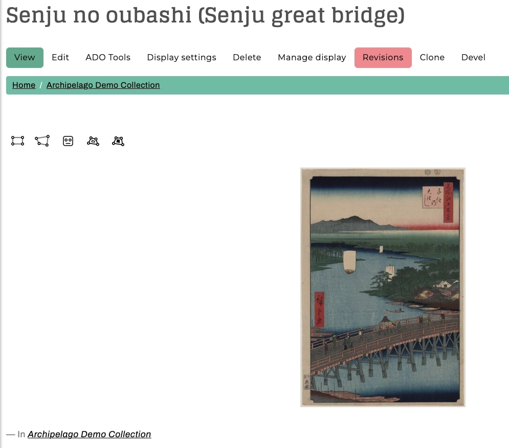

**Please refer to the main [Find and Replace documentation page](find_and_replace.md) for a general overview of [where to find within your Archipelago](find_and_replace.md#where-to-find), a [general overview of default options](find_and_replace.md#main-page-overview) and [important notes and workflow recommendations](find_and_replace.md#important-notes--workflow-recommendations).**

# Using Webform Find and Replace 

Along the top of the main Home page, navigate to Tools (Repository Content Tools) and select 'Advanced Batch Find and Replace' from the drop down menu.

  
  

## Step 1: Digital Object/Collection Discovery 
  
Depending on your specific use case, you can utilize the Fulltext search, Facets, or a combination of both to aid in the discovery and selection of the ADOs you wish to perform the Webform Find and Replace action on.
  
To use the Fulltext search, type any defining descriptive metadata values (i.e. Title, Date) directly in the search bar and click 'Search'. To narrow down potentially lengthy results, you can utilize the facets by selecting a value beneath an appropriate descriptive metadata source. 

  

To generate the results (ADOs) of a specific AMI set, you can select the set under the facet 'Ingest Method Service URL'

  

  

## Step 2: Digital Object/Collection and Webform Find and Replace Action Selection

To Select the appropriate ADO(s) to undergo the Webform Find and Replace operation, click the toggle next to the individual ADO Title. If you wish to select all of your search results, click the toggle next to 'select/deselect all results'. Once selected, the toggle next to the ADO(s) will be highlighted.

To see a full list of selected ADO(s) use the dropdown menu labled 'Selected'. It is also recommended that you utilize the 'Raw metadata (JSON)' dropdown to check that that the search and replace values for your selected ADO(s) is accurate.

   

Next, select 'Webform find-and-replace Metadata for Archipelago Digital Objects content item' from the Action dropdown menu and click 'apply to selected items'.

  

## Step 3: Webform Find and Replace Action Configuration

Here you will need to select the configurations to be applied to your chosen ADOs.

From the dropdown:

- 1.) Select which Webform you want to use
- 2.) Select which Form element you want to use
- 3.) Select which value to search for in the [chosen form element] JSON key
- 4.) Select which value to replace with in the [chosen form element] JSON key

The screenshot below shows an example configuration for the *type JSON key (media type)* where the type value *Visual Artwork* will be searched for and replaced with type value *Photograph*
  

  

## Simulation Option

Before selecting 'Apply', there is an option to run a Simulation on your chosen configurations. By selecting this option, you will be able to carry out a simulated patch and preview action results. To run a simulation, tick the box next to 'only simulate and debug affected JSON' and select 'Apply'.

On the next screen, you will see a list of your selected items with an option to 'execute action' or 'cancel'. Select, 'execute action'.

Once executed, you will receive a notification displaying the results of your simulated processing and whether or not the patch rendered a match for modification.

  **Example of Match**
  

  **Example of No Match**
  

## Step 4: Execute Webform Find and Replace (Non-simulation)

To execute the Webform Find and Replace you will need to follow steps 2 and 3 once more except this time you will leave the simulate option unticked at the end of step 3. Now select, 'Apply'.

On the next screen, select 'execute action'.

Once the action is finished processing you will receive a notification displaying that your ADO revision persisted to the Filesystem and was successfully patched.

  

## Step 5: Revisions

How to check your changes:

Navigate to the ADO you just performed the Webform Find and Replace on and select the 'Revisions' tab.

  

*Language from form itself:*

*Revisions allow you to track differences between multiple versions of your content, and revert to older versions.*

The current revision will always be at the top of the list.

  

___
Thank you for reading! Please contact us on our [Archipelago Commons Google Group](https://groups.google.com/forum/#!forum/archipelago-commons) with any questions or feedback.

Return to the [Archipelago Documentation main page](index.md).

