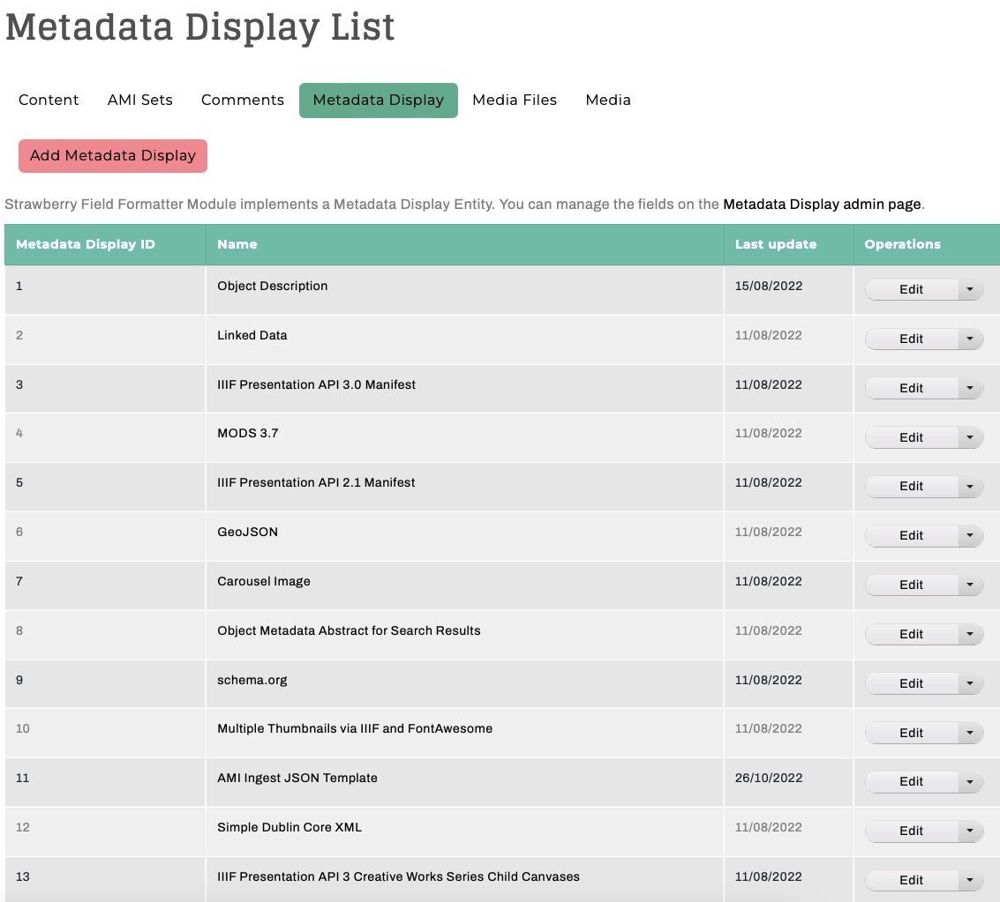
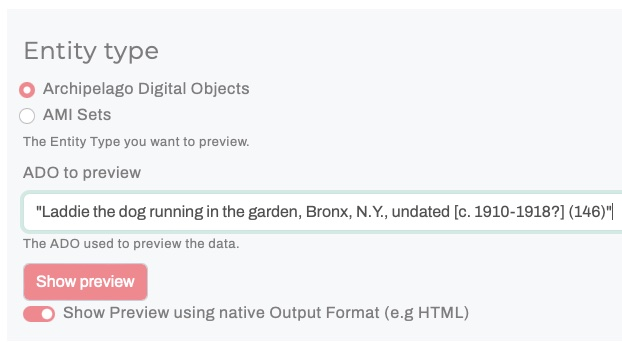
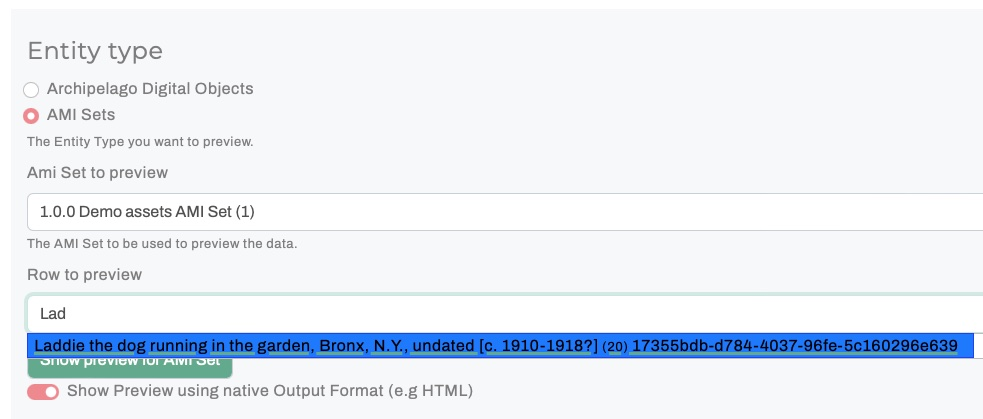
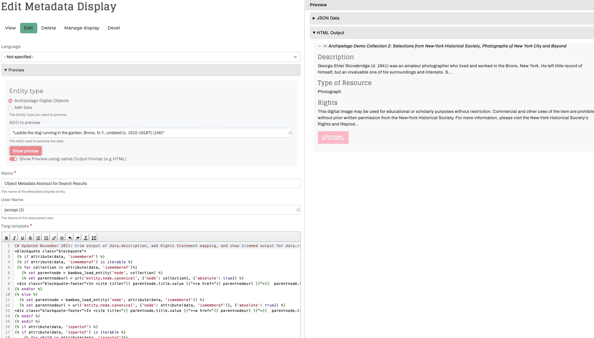
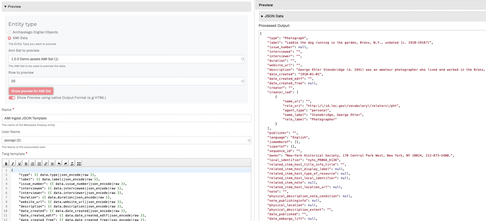
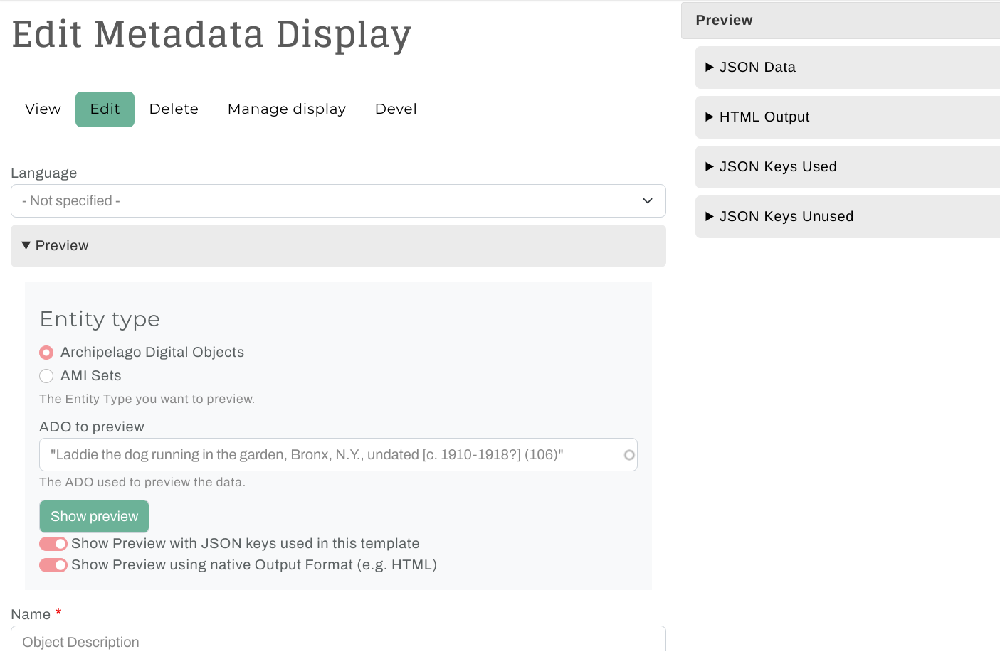
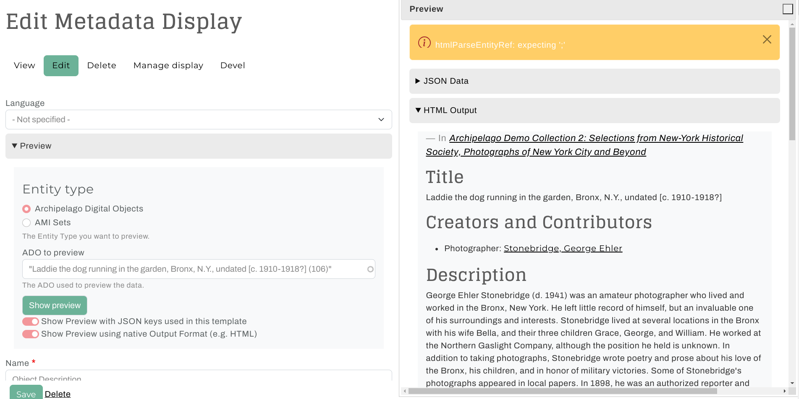
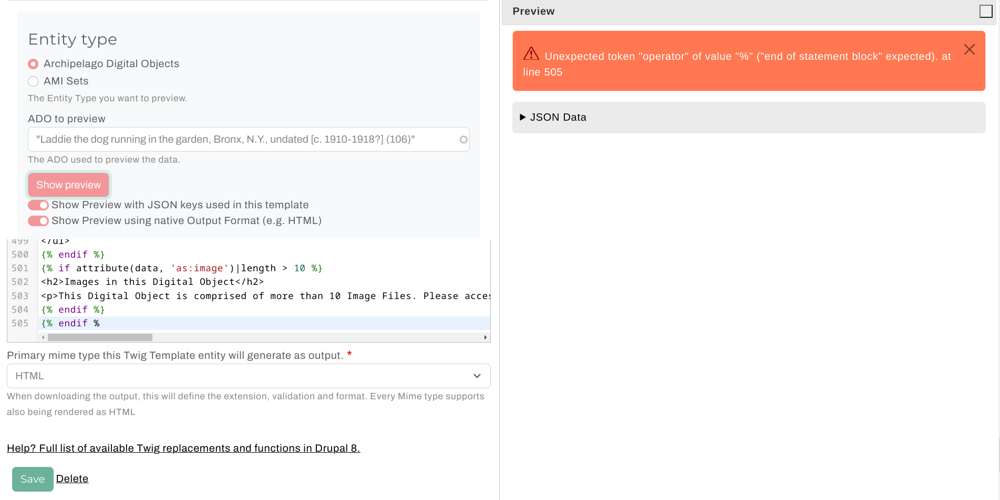

# Metadata Display Preview

Archipelago's Metadata Display Preview is a very handy tool for your repository toolkit that enables you to preview the output of your Metadata Display (Twig) Templates (found at `/metadatadisplay/list`). You can use the Metadata Display Preview to test and check the results of any type of Template (HTML Display, JSON Ingest, IIIF JSON, XML, etc.) against both Archipelago Digital Objects (ADOs) and AMI Sets (rows within). 

!!! note "Prerequisite Note"

    Before diving into Metadata Display (Twig) Template changes, we recommend reading our [Twigs in Archipelago documentation](metadatatwigs.md) overview guide and also our [Working with Twig](workingtwigs.md) primer.

## Step-by-Step

1. Navigate to the Metadata Display list at `/admin/content/metadatadisplay/list` (or through the admin menu via  `Manage > Content > Metadata Displays`). From the main Metadata Display List page, you can access all of the different display, rendering, and processing templates found in your Archipelago.

    

2. Open and select 'Edit' for the Template you wish to Edit and/or Preview.

    

3. You will now be able to select either an Archipelago Digital Object (ADO) or AMI Set to Preview. Both selection types will use an autocomplete search (make sure the autocomplete matches fully against your selection before proceeding).

    - Archipelago Digital Object (ADO) selection:
    

    - AMI Set and Row selection:
        - For the Row, you can enter either a (CSV row) number: 
        

        - Or a label found within the Source Data CSV:
        

4. After you select your ADO or AMI Set and press the `Show Preview` button, the fuller Preview section will open up on the right side of the screen. The left side will continue to show the Metadata Display Template you originally selected to Edit.

    !!! tip

        It is **strongly recommended** to always select the option to "Show Preview using native Output Format (e.g. HTML)".

    - Archipelago Digital Object (ADO) selection against an HTML Display template:
    
    
    - AMI Set and Row selection against a JSON Ingest template:
    

5. To keep track of the JSON keys used in your template select the `Show Preview with JSON keys used in this template` option before pressing `Show Preview`. For more details see [below](#metadata-display-preview-json-key-variables).

5. Within the Preview Section on the right side of the screen:
    - The top section contains full JSON metadata record for the selected digital object or AMI Set + specified row.
    - If previewing against an AMI Set + specified row, the middle section will show the 'Reconciliated LoD' for the selected row if you have used AMI LoD Reconciliation for the selected AMI Set.
    - The bottom section will show the rendered Output from the Template using the metadata from the selected ADO or AMI Set + specified row.
    
6. From the Edit + Preview mode, you can:
    - Add and edit additional JSON keys to an HTML-output Display Template, such as subjects from LoD sources, found in your digital objects and collections data.
    - Preview your incoming AMI Sets against your Ingest Template to ensure all your Source Data CSV columns and values are being being mapped properly to their Archipelago destination JSON keys; And make adjustments as needed.
    - Enrich a provided schema-based XML template to incorporate more elements found in your Archipelago environment.
    - And more 🧑‍🍳🎨🏄     

7. Select the `Show Preview` button as you make changes to refresh the Preview output and check your work. After saving any changes you may have made to your selected Template, all of the displays/AMI Sets/other outputs that reference this same Template will reflect the changes made.

## Metadata Display Preview JSON Key Variables

When creating or editing a Metadata Display Twig template, you can keep track of the JSON keys being used in the template by enabling the option after selecting an Archipelago Digital Object (ADO) or AMI Set row before pressing `Show preview`:

!!! example "Enable Metadata Display Preview Variables"

    

The last two tabs in the Preview section above expand to show two tables listing the JSON keys that are used and unused by the template. The used keys are sorted by first instance line number (from the template) and the unused keys are sorted alphabetically.

!!! example "Metadata Display Preview Variables Used JSON Keys"

    

!!! example "Metadata Display Preview Variables Unused JSON Keys"

    

The JSON Keys that appear in these tables will vary based on changes to the template and the selected ADO or AMI set row.

## Warnings and Errors

Warnings and Errors encountered during the processing will be shown at the top of the Preview section. A line number (from the template) will be included in the message if available.

!!! example "Warning"

    A Warning will be generated if output can be rendered, and the output will be displayed below it.

    

!!! example "Error"

    An Error will be generated if no output can be rendered, and no output will be displayed.

    

___

Thank you for reading! Please contact us on our [Archipelago Commons Google Group](https://groups.google.com/forum/#!forum/archipelago-commons) with any questions or feedback.

Return to the [Archipelago Documentation main page](index.md).
