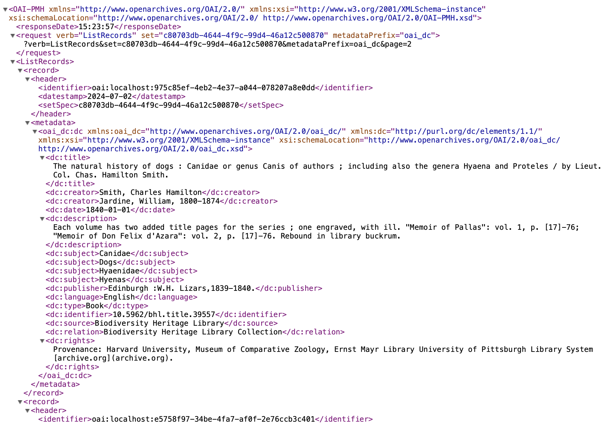

# Metadata API Module

Archipelago's Metadata API Module is a special Strawberryfield Formatter Module that implements Metadata API Endpoints and uses Views and Metadata Display Entities as a configuration option to provide dynamic APIs based on Metadata present in each Archipelago Digital Object (or Node) that contains a Strawberryfield type of field (JSON). 

Beginning with Archipelago 1.4.0, Archipelago is shipped with a standard implementation of a set of OAI-PMH functions. This includes a full Open API Configuration for OAI-PMH in the Metadata API Module, a corresponding OAI-PMH View, and two corresponding OAI-PMH Metadata Display Templates (Wrapper and Item to output object data into Dublin Core XML). All of these components are necessary to enable OAI-PMH functionality in your Archipelago. Please see the notes below that further explain the specific OAI-PMH `verbs` (request and response types) supported by Archipelago's default configuration. Please see the [OAI Protocol for Metadata Harvesting Specifications](https://www.openarchives.org/OAI/openarchivesprotocol.html) for more information about OAI-PMH functions.

### Quick Local Test Drive for OAI-PMH

The default configurations (specifically the View, see more details below) limits the OAI-PMH queries to members of the 'Biodiversity Heritage Library Collection' (Node #25 as ingested via the default AMI Demo Set).

To give this a quick test drive in your running local 1.4.0 Archipelago deployment, copy and paste the following query into your browser:

```shell
http://localhost:8001/ap/api/oai_pmh/oai?verb=ListRecords&set=c80703db-4644-4f9c-99d4-46a12c500870&metadataPrefix=oai_dc
```

??? info "Click to see the Example Test Drive Results"

    

## 1. Default OAI-PMH Configuration Form

You can find the Metadata API Module Configuration Form:

- Through the `Manage` menu > `Configuration` > `Archipelago` > `Configure Metadata APIs`
- Directly at `/admin/config/archipelago/metadataapi` 


### Default Supported OAI-PMH Verbs & Configuration

In Archipelago's default `oai_pmh` Metadata API Endpoint, the following [OAI-PMH verbs (requests and responses)](https://www.openarchives.org/OAI/openarchivesprotocol.html#ProtocolMessages) are supported:

- GetRecord
- Identify
- ListIdentifiers
- ListMetadataFormats
- ListRecords
- ListSets

??? info "Click to see the Full Default OAI-PMH Open API Config"

    ```JSON title="JSON of Default OAI-PMH Open API Config"
    {
        "openapi": "3.0.2",
        "info": {
            "title": "Test API",
            "version": "1.0.0"
        },
        "paths": {
            "http://localhost:8001/ap/api/oai_pmh/{oai}": {
                "get": {
                    "parameters": [
                        {
                            "name": "verb",
                            "in": "query",
                            "description": "",
                            "required": true,
                            "deprecated": false,
                            "style": "form",
                            "explode": true,
                            "schema": {
                                "enum": [
                                    "GetRecord",
                                    "Identify",
                                    "ListIdentifiers",
                                    "ListMetadataFormats",
                                    "ListRecords",
                                    "ListSets"
                                ],
                                "type": "string"
                            }
                        },
                        {
                            "name": "set",
                            "in": "query",
                            "description": "",
                            "required": false,
                            "deprecated": false,
                            "style": "form",
                            "explode": true,
                            "schema": {
                                "type": "string",
                                "format": "uuid"
                            }
                        },
                        {
                            "name": "identifier",
                            "in": "query",
                            "description": "",
                            "required": false,
                            "deprecated": false,
                            "style": "form",
                            "explode": true,
                            "schema": {
                                "type": "string",
                                "format": "uuid"
                            }
                        },
                        {
                            "name": "oai",
                            "in": "path",
                            "description": "",
                            "required": true,
                            "deprecated": false,
                            "style": "simple",
                            "explode": false,
                            "schema": {
                                "type": "string"
                            }
                        },
                        {
                            "name": "page",
                            "in": "query",
                            "description": "",
                            "required": false,
                            "deprecated": false,
                            "style": "form",
                            "explode": true,
                            "schema": {
                                "type": "integer"
                            }
                        },
                        {
                            "name": "metadataPrefix",
                            "in": "query",
                            "description": "",
                            "required": false,
                            "deprecated": false,
                            "style": "form",
                            "explode": true,
                            "schema": {
                                "enum": [
                                    "oai_dc",
                                    "mods"
                                ],
                                "type": "string"
                            }
                        },
                        {
                            "name": "from",
                            "in": "query",
                            "description": "",
                            "required": false,
                            "deprecated": false,
                            "style": "form",
                            "explode": true,
                            "schema": {
                                "type": "string",
                                "format": "date"
                            }
                        },
                        {
                            "name": "until",
                            "in": "query",
                            "description": "",
                            "required": false,
                            "deprecated": false,
                            "style": "form",
                            "explode": true,
                            "schema": {
                                "type": "string",
                                "format": "date"
                            }
                        }
                    ]
                }
            }
        }
    }
    ```


### Reviewing and Editing the Default OAI-PMH Configuration Form

You can make changes to the above configurations by selecting `Edit` on the right-hand side of the configuration overview.


!!! warning "Caution with making changes"

    Proceed with caution before making changes to the default OAI-PMH Configuration Form. This functionality relies on the interconnected components described in this documentation. Before making changes to the configuration form itself, first backup your configurations so you can revert your changes if needed. It is also recommended to test your changes in a local environment before implementing in a production instance.
   

## 2. Default OAI-PMH View

- Through the `Manage` menu > `Structure` > `Views` > `OAI_exposed_entity_reference`
- Directly at `/admin/structure/views/view/oai_exposed_entity_reference` 

As stated above, the Default OAI-PMH View is configured to limit the OAI-PMH queries to members of the 'Biodiversity Heritage Library Collection' (Node #25 as ingested via the default AMI Demo Set). To change the collection this View limits queries and results for, change the Node ID listed in the `Content datasource: # Strawberry_(Descriptive Metadata source) » entity_sbf_entity_reference_ismemberof` under the Filter Criteria section.


* Please note: this View is using the **Full Pager**, and this is required for properly outputting the fuller lists of results for OAI-PMH queries.

## 3. Default OAI-PMH Templates

The default OAI-PMH functionality relies on using two Metadata Display Templates, one for wrapping or setting the query results within a standard structure, and one for outputting individual query results (such as the Dublin Core XML for a specific Archipelago Digital Object). The two different templates are specified at the bottom of the OAI-PMH Configuration Form described above.


### OAI-PMH Wrapper Template

- Found at: http://localhost:8001/metadatadisplay/17
- The Metadata display Entity (Twig) used to generate data for the API wrapper response.

### OAI-PMH Item with DC Template

- Found at: http://localhost:8001/metadatadisplay/18
- The Metadata display Entity (Twig) to be used to generate data at this endpoint.

!!! warning "Caution with making changes"

    Please also proceed with caution before making changes to the default OAI-PMH Metadata Display Templates. Before saving any changes you make to the templates, mark to save as a 'Revision' at the bottom of the template form, so you can revert your template to a previous version if needed.
   
__

Return to the [Archipelago Documentation main page](index.md).
