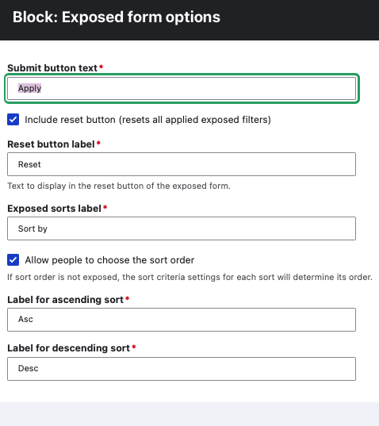
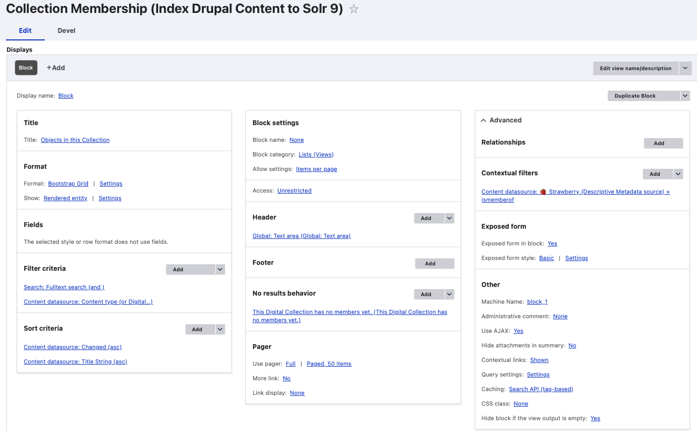
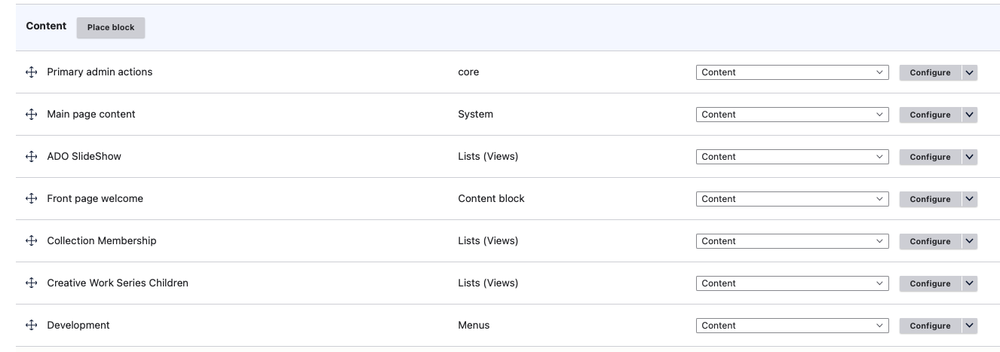
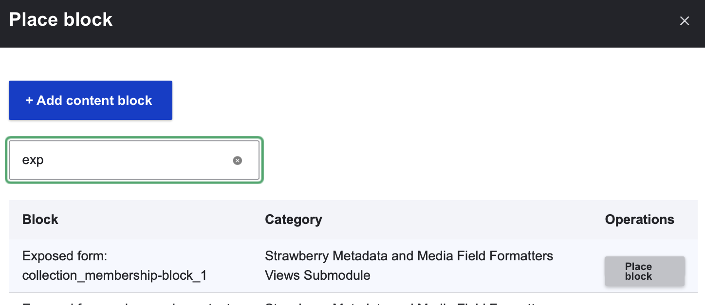
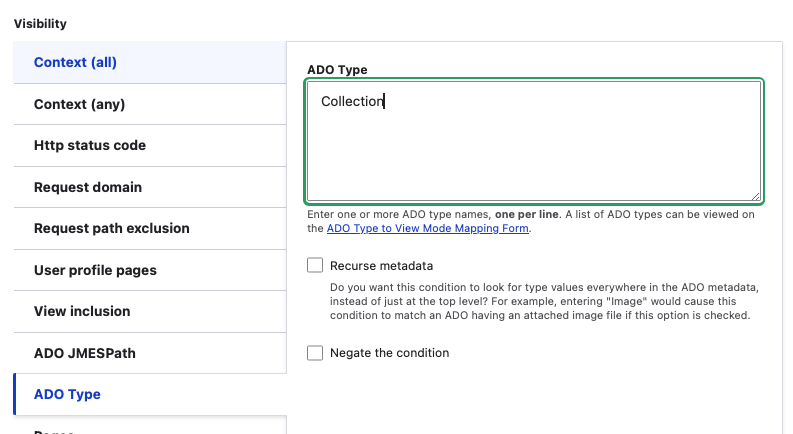
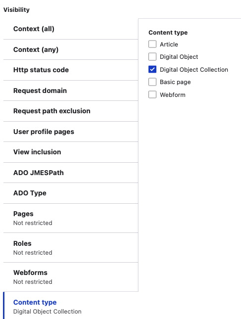
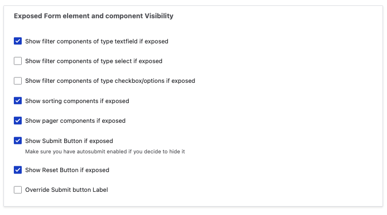
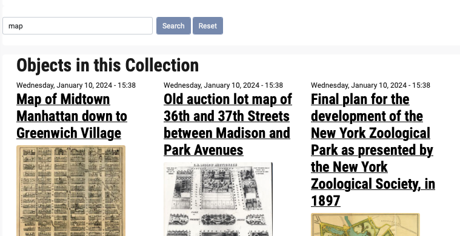

#  How to Add a 'Search Within Collection' Block

This guide covers how to add a 'Search Within Collection' Exposed Form Block to the default Archipelago default Collection Display Page. 

### Preamble + prerequisites 

Before diving into any Search and Solr configuration changes, we strongly recommend that you read our [Metadata in Archipelago](metadatainarchipelago.md) overview documentation, which provides important context for understanding how the shape of your Archipelago Digital Objects/Collections (ADOs) metadata will inform your Search and Solr options and outcomes. If you don't have the bandwidth to read the (stellar) [Metadata in Archipelago](metadatainarchipelago.md) documentation, we recommend you read through our [in-a-nutshell](/search_solr_index/#in-a-nutshell-json-data-to-strawberry-keyname-providers-to-solr) overview.

You may also wish to pair this 'Search Within Collection' Exposed Form Block with related Facets (setup on the same corresponding collection membership View). You can find follow the step-by-step instructions in our [Strawberry Key Name Providers, Solr Field, and Facet Configuration documentation](strawberry_key_name_providers.md). 

## Step 1:  Open the Collection Membership View

Navigate to the Collection Membership view found at:

- `/admin/structure/views/view/collection_membership`
- Through the `Structure` menu > `Views` > `Collection Membership`

This View is setup to list the member Digital Objects of a Collection and is driven by Solr.

## Step 2. Adjust the View's Advanced tab settings

Open the 'Advanced' tab settings and change the 'Exposed form in block' to *'Yes'*.

## Step 3. Add the Fulltext Search Filter Criteria for the View

Under the 'Filter criteria' section, add and configure the 'Fulltext Search' Criteria for the Collection Membership View.

![Add Filter Criteria]

At the top of the 'Configure filter criterion: Search: Fulltext search' form that opens, select the option to 'Expose this filter to visitors, to allow them to change it'.

On the form below, adust the following configuration options:

- Remove any text from 'Label' or 'Description
- Operator: select/check 'Contains all of these words'
- Allow multiple selections : leave unchecked
- Remember the last selection : leave unchecked
- Filter identifier: leave default of 'search_api_fulltext'
- Placeholder: enter 'Search within Collection' (or your preferred text)
- Search field character limit: set to '128'
- Expose searched fields : leave unchecked
- Searched fields : leave all unselected, so "If no fields are selected, all available fulltext fields will be searched."
- Minimum keyword length : set to '1'

Select Apply and continue to next Step.

## Step 4. Review/adjust options and Save the Updated View

Review and optionally adjust the options. If you make any changes select, 'Apply' before exiting.

'Save' your changes made to the View before proceeding.

Your updated Collection Membership View should look like the following now:

## Step 5. Place the Exposed Form Block

Navigate to the Block Layout found at:

- `/admin/structure/block`
- Through the `Structure` menu > `Block layout`

Select the `Archipelago Base Theme` (or whatever theme you are using):

- `admin/structure/block/list/archipelago_subtheme`

Navigate to the 'Content' section of the theme and select *'Place Block'*.

Search for the 'Exposed form: collection_membership-block_1' and select *'Place Block'*.

## Step 6. Configure the Block's Settings:

Configure the different settings for the Block. 

You will need to specify both of the following options under the `Visibility` section:

- ADO Type: specify Collection (and any other Collection types you may also have such as 'Newspaper')

- Content type: select 'Digital Object Collection'

In the top section of the form, we recommend the following settings:

- Deselect 'Display title'
- Under `Exposed Form element and component Visibility`, deselect the following:
    * Show filter components of type select if exposed
    * Show filter components of type checkbox/options if exposed
    * Override Submit button Label
    

Select 'Save block' when you are finished configuring the Block's Settings.

## Step 7. Position the Block and Save.

Drag to re-order and position the Exposed Form Block to sit above the Collection Membership block in the `Content` section. This will position the Exposed Form Block above the list of Collection Member Objects.

After you have positioned the blocks, Scroll down to the bottom of the `Block layout` page and select *'Save blocks'*.

## Step 8. 

Navigate to a Collection and test out a Search in the search box that is in place above the 'Objects in this Collection.

In this screenshot, you can see a demonstrative Search for 'map' within one of the Archipelago Demo Collections.

#### Additional Considerations

You may also wish to pair this 'Search Within Collection' Exposed Form Block with related Facets (setup on the same corresponding collection membership View). You can find follow the step-by-step instructions in our [Strawberry Key Name Providers, Solr Field, and Facet Configuration documentation](strawberry_key_name_providers.md).

___

Thank you for reading! Please contact us on our [Archipelago Commons Google Group](https://groups.google.com/forum/#!forum/archipelago-commons) with any questions or feedback.

Return to the [Archipelago Documentation main page](index.md).
