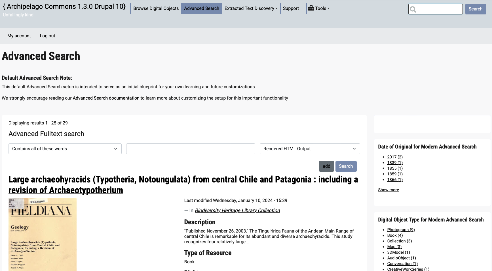
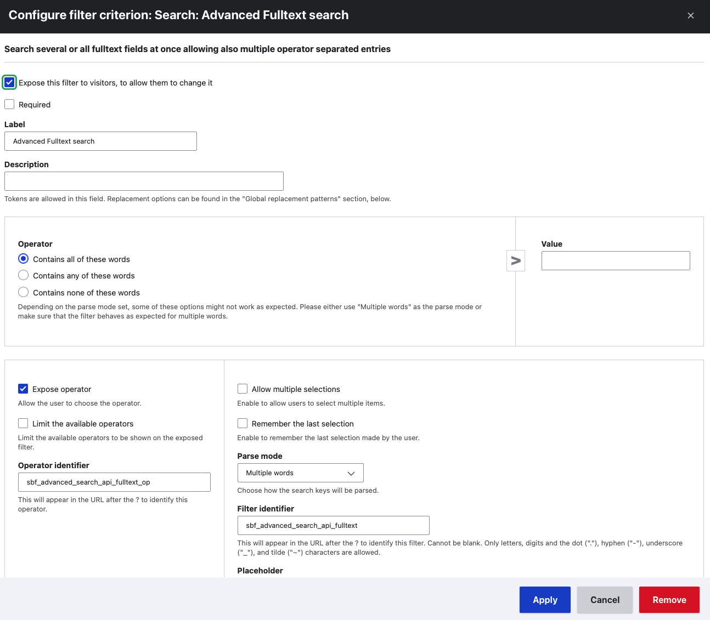
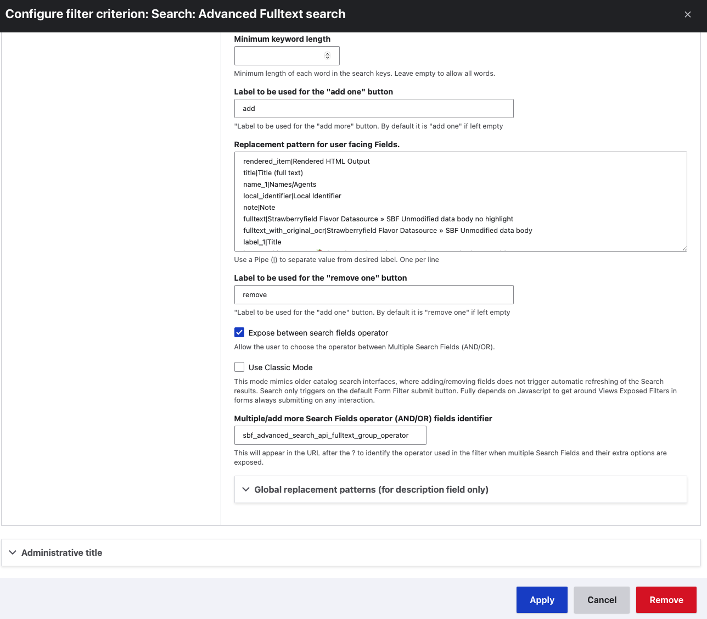
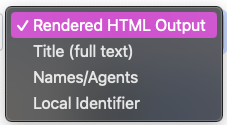
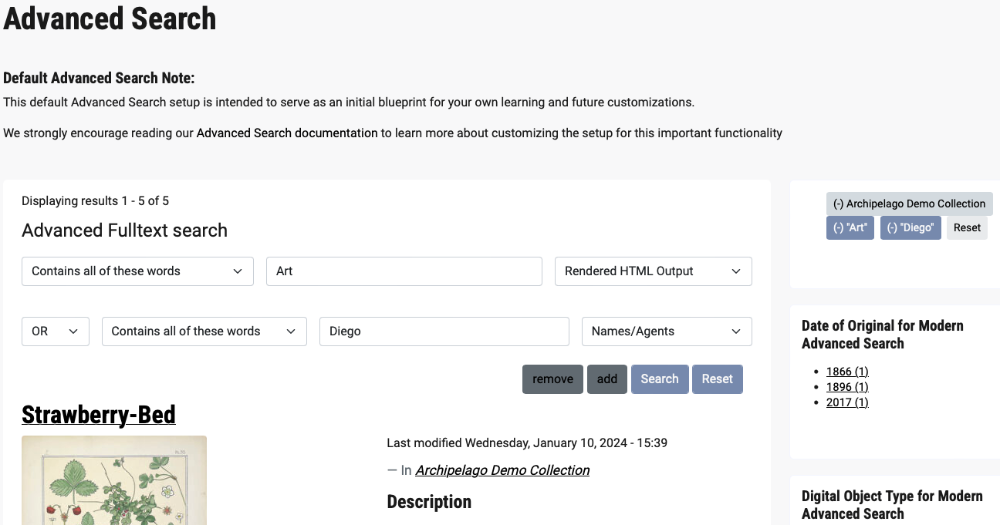

# Advanced Search

To provide Advanced Search functionality, Archipelago extends a custom Search API based Fulltext Filter for (Drupal) Views. This special 'Search: Advanced Fulltext search' filter is capable of handling multiple inputs with a combination of Boolean Operators, and features additional customizable options for tailoring your Archipelago's Advanced Search setup.

## Default Advanced Search:

The default Advanced Search setup shipped with standard Archipelago deployments is intended to serve as an initial blueprint for your own learning and further customizations. Your Archipelago instance, whether you are working in a modified local or production deployment, may not have the same corresponding Solr Fields and/or Facets as present in the default Advanced Search configuration. This guide covers the default Advanced Search Setup, and offers general guidance for customizing to match your desired Advanced Search setup for your unique environment variables (metadata elements/schema found in your JSON data, Keyname combinations, Solr fields, etc.).

## Where to Find and Corresponding Configurations

In default Archipelagos, you can find Archipelago's default Advanced Search page:

- Through the top navigation menu > `Advanced Search`
- Directly at `/advanced-search`

The default Advanced Search Page includes the following:

- Advanced Fulltext Search form (more information on the out-of-the-box View settings associated with this form below)
- Five Facets for narrowing your results (Date of Original, Digital Object Type, Collection Membership, Subjects, and Agents)
- A Facet Summary section (visible only after selecting Facets)
- Custom Block containing a Default Advanced Search Note

The five Facets associated with the default Advanced Search can be found at `Administration > Configuration > Search and metadata > Facets` under the `Facet source - search_api:views_page__advanced_search__page_1`.

The Custom Block containing the Default Advanced Search Note can be found at `/admin/content/block` or as a Tab on the main Content page.

The corresponding Facet Blocks and Custom Block can be found at `/admin/structure/block/list/archipelago_subtheme` in the `Sidebar Second` section. Please see the [this documentation for more information about Keyname Providers, Solr Fields, and Facet Configurations](strawberry_key_name_providers.md)

## Advanced Search View

The default Advanced Search View drives the Advanced Search Form. This View can be found at:

- `/admin/structure/views/view/advanced_search`
- Through the `Structure` menu > `Views` > `Advanced Search`

### Configuring the filter criteria for the 'Search: Advanced Fulltext search'

To view or adjust the configurations click on 'Search: Advanced Fulltext search (and)' in the 'Filter criteria section in the View. You will then see the first part of the following configuration form:

#### Part 1 of the Advanced Search Filter Form

Beginning at the top of the form, you will see:

- Brief note explaining that the Advanced Fulltext search filter can 'Search several or all fulltext fields at once allowing also multiple operator separated entries'
- Option to 'Expose this filter to visitors, to allow them to change it'
     * checked in default
- Option to marked as 'Required'
     * unchecked in default
- Label: Text field to enter Label for this filter
     * set to 'Advanced Fulltext search' in default
- Description: Text field to enter brief description for this filter.
    * Tokens are allowed in this field. Replacement options can be found in the "Global replacement patterns" section, below.
    * empty in default
     
You will then see a section for configuring the starting Operator to use for the form:

- Contains all of these words
     * checked in default
- Contains any of these words
- Contains none of these words
- A note that 'Depending on the parse mode set, some of these options might not work as expected. Please either use "Multiple words" as the parse mode or make sure that the filter behaves as expected for multiple words.'
- An optional starting `Value`
    * empty in default

Next is the beginning of the fuller Operator and Additional Options:

- Option to 'Expose operator' 
    * Allow the user to choose the operator
    * checked in default
- Option to 'Limit the available operators'
    * Limit the available operators to be shown on the exposed filter
    * unchecked checked in default
    * recommended to enable for Classic Mode _(see further notes related to Classic Mode below)_
- Operator identifier: Text field to specify 'the URL after the ? to identify this operator'
    * set to 'sbf_advanced_search_api_fulltext_op' in default
- Option to 'Allow multiple selections' (Enable to allow users to select multiple items)
- Option to 'Remember the last selection' (Enable to remember the last selection made by the user)
- Parse mode : dropdown menu to choose how the search keys will be parsed
    * Direct query
    * Single phrase
    * **Multiple words** _*selected by default and strongly recommended to keep_
    * Multiple words with EDisMax
    * Multiple words with fuzziness
    * Phrase search with sloppiness Multiple words with sloppiness
- Filter identifier : Text field to specify what will appear in the URL after the ? to identify this filter
    * Cannot be blank. Only letters, digits and the dot ("."), hyphen ("-"), underscore ("_"), and tilde ("~") characters are allowed.
    * set to 'sbf_advanced_search_api_fulltext' in default

#### Part 2 of the Advanced Search Filter Form

- Placeholder : Text field to enter hint text that appears inside the field when empty
    * empty in default
- Note about the 'Multiple words' parse mode (selected earlier in the form)
    * The query is interpreted as multiple keywords separated by spaces. Keywords containing spaces may be "quoted". Quoted keywords must still be separated by spaces. Keywords can be negated by prepending a minus sign (-) to them.
- Search field character limit : specify the maximum number of characters to allow as keywords input.
    * set to 128 in default
- Option to 'Expose searched fields', which allows users to narrow the search to the desired fields.
     * checked in default
- Searched fields identifier : text field to specify the URL after the ? to identify this searched fields form element.
    * set to 'sbf_advanced_search_api_fulltext_searched_fields' in default
- Option to have 'Multiple/add more Search Fields'
    * This allows users to add more Search Fields with the same general exposed settings. All identifiers passed by this filter in the URL after the ? will get an incremental suffix.
     * checked in default
- Max number of Multiple/add more Search Fields the user can expose.
    * The number of additional search Fields with the same general exposed settings the user will be able to expose.
    * set to a value of '4' in default
    
- Searched fields
    * Select the fields that will be searched. If no fields are selected, all available fulltext fields will be searched.
    * The options exposed here will be dependent on your configured Solr Fields.
    * Fields selected by default include: 
        1. Content > Strawberry (Descriptive Metadata source) > local_identifier
        2. Content > Strawberry (Descriptive Metadata source) > name
        3. Rendered HTML output
        4. Content > Title FullText

- Min number of Multiple/add more Search Fields the user will see.
    * Number must be less or equal to the max. If not it will cap automatically.
    * The number of search Fields with the same general exposed settings the user will see by default.
    * set to a value of '1' in default
    
- Minimum keyword length
    * Minimum length of each word in the search keys. Leave empty to allow all words.
    * empty in default

#### Part 3 of the Advanced Search Filter Form

In the last part of the form, you will see:

- Label to be used for the "add one" button
    * "Label to be used for the "add more" button. By default it is "add one" if left empty
    * empty in default
    
- Replacement pattern for user facing Fields.
    * In this text area, you will have the option to supply your preferred user-facing label for your selected search fields.
    * You will see all of the fields available in your Solr.
    * You supply your preferred labels and set the user-facing dropdown ordering for your targeted fields being used.
    * Use a Pipe (|) to separate value from desired label. One per line
    * To adjust the label for a field, replace the text following the pipe (|) symbol in the string to your preferred label.
    * Field label adjustments and order specified selected by default include:
        1. rendered_item|Rendered HTML Output
        2. title|Title (full text)
        3. name_1|Names/Agents
        4. local_identifier|Local Identifier

- Label to be used for the "remove one" button
    * "Label to be used for the "add one" button. By default it is "remove one" if left empty
    * set to 'remove' in default
- Option to 'Expose between search fields operator'
    * Allow the user to choose the operator between Multiple Search Fields (AND/OR)
    * checked in default    
    
#### Classic Mode

- Option to 'Use Classic Mode' : When you select the 'Classic Mode', your Advanced Search form will interact in a way that mimics older catalog search interfaces. This means that:
    * when you add/remove fields, this does not trigger automatic refreshing of the Search results
    * search only triggers on the default Form Filter submit button
    * this mode fully depends on Javascript to get around Views Exposed Filters in forms always submitting on any interaction.
    * unchecked in default
    
If you specify to 'Use Classic Mode', you will also see:

- Option to  'Add a Remove button to every Advanced Search Field combo.'
    * This will allow a user to remove a specific Advanced Search Field/And/or/Text. Only works on Classic Mode
    * only appears on form when 'Use Classic Mode' is enabled, hidden and unchecked in default
    * strongly recommended to enable for Classic Mode setups
    
- Please see above note in Part 1 of the Advanced Search Filter Form to also select the option to '- Option to 'Limit the available operators' when using Classic Mode.  

#### End of Advanced Search Filter Form

For both the normal, modern Advanced Search setup and also with Classic Mode enabled, you will also see:

- Multiple/add more Search Fields operator (AND/OR) fields identifier
    * Text field to specify what will appear in the URL after the ? to identify the operator used in the filter when multiple Search Fields and their extra options are exposed.
    * set to 'sbf_advanced_search_api_fulltext_group_operator' in default
    
- You will also see a section for 'Global replacement patterns (for description field only), where you can Brose available tokens for this purpose.
    * No replacement patterns specified for the View Description field in default. Not recommended.

### Example Query Test

In your local or fresh live Archipelago deployment, populated with the Archipelago Demo Set Objects and Collections, test your Advanced Search setup using the following query:
- 'Contains all of these words' + the term 'Art' in the 'Rendered HTML Output' Field
- 'OR' operator + 'Contains all of these words' + the term 'Diego' in the 'Names/Agents' field
- Select the 'Archipelago Demo Collection' from the Collection Membership Facet

You should see the following results:

The corresponding advanced search url should be:
- http://localhost:8001/advanced-search?sbf_advanced_search_api_fulltext_op=and&sbf_advanced_search_api_fulltext=Art&sbf_advanced_search_api_fulltext_searched_fields=rendered_item&sbf_advanced_search_api_fulltext_advanced_search_fields_count=2&sbf_advanced_search_api_fulltext_group_operator_1=or&sbf_advanced_search_api_fulltext_op_1=and&sbf_advanced_search_api_fulltext_1=Diego&sbf_advanced_search_api_fulltext_searched_fields_1=name_1&f%5B0%5D=is_member_of_content_title%3AArchipelago+Demo+Collection&op=Search

___

Thank you for reading! Please contact us on our [Archipelago Commons Google Group](https://groups.google.com/forum/#!forum/archipelago-commons) with any questions or feedback.

Return to the [Archipelago Documentation main page](index.md).
