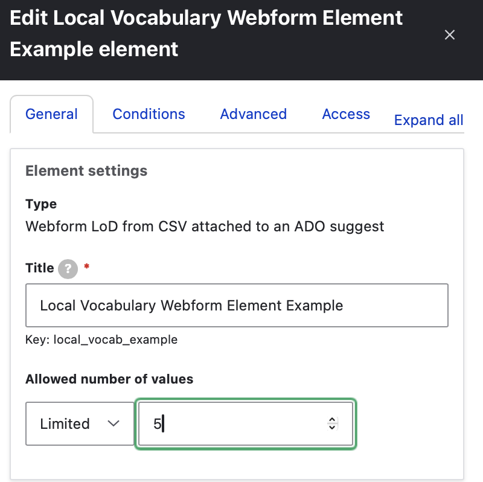
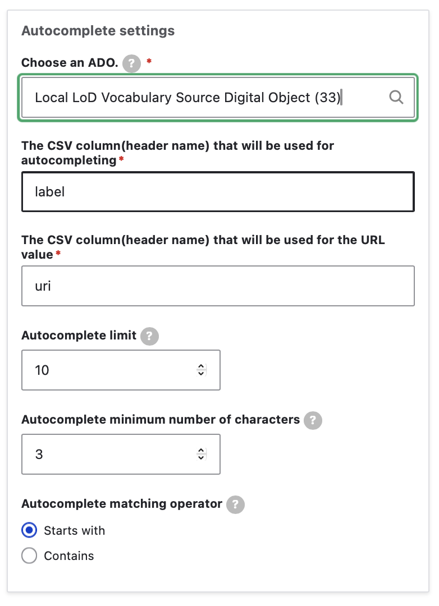
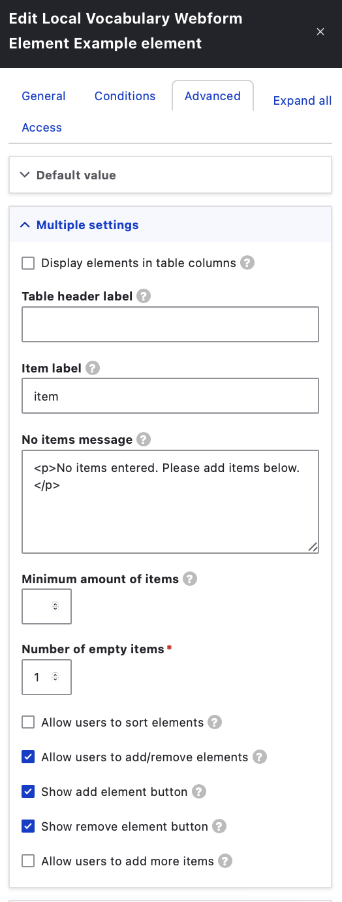

# Using Archipelago's 'Webform LoD from CSV attached to an ADO suggest'

Archipelago's custom webform element 'Webform LoD from CSV attached to an ADO suggest' provides a form element autocomplete labels/urls(values) from a CSV attached to a Digital Object. Using this element affords a way for you to utilize a custom local vocabulary, a subset of labels and URIs from a wider LoD authority source, or an LoD vocabulary that does not have an accessible API or public query service.

## Step-by-step

### 1. Prepare your CSV File

To use this element, you need to first have prepared a CSV file containing two columns only:

* one column for 'label' containing the labels for your vocabulary
* one column for 'uris' containing the corresponding uris for your vocabulary
    
### 2. New ADO Using Your CSV File

Create a new Digital Object, and attached the prepared CSV file to the new Digital Object.

* Be sure to provide a unique label to help you identify this Object in future steps.
* It is recommended that you do not Publish this Object.

!!! note

    If you are not yet familiar with how to create a Digtial Object, please refer to [this guide](firstobject.md).

### 3. Edit your Webform

Go to `Admin > Structure > Webforms` and select the 'Build' button beside the Default Descriptive Metadata Webform.

### 4. Add New Custom Webform Element

Scroll down to the 'Subjects and Other Classifications' page of the Webform and select 'Add Element'.

  

### 5. Webform from LoD from CSV attached to an ADO suggest

In the 'Select an element to add ..' popup that opens:

* Either scroll down to select the 'Composite Element' section or search for the 'Webform LoD from CSV attached to an ADO suggest.' 
* Select 'Add Element'.

  

### 6. Adjust Element Settings

In the Edit tab that opens for your newly added element, you will need to review the following sections.

* **Element Settings**

    - provide a Title for element
    - check that the Key generated from the Title you supply is well formed and make changes if needed
    - specify the 'Allowed number of values'

  

* **Webform LoD from CSV attached to an ADO suggest settings**:

    - It is recommended to keept both 'label' and 'uri' checked as Visible.
    - You may also wish to mark both elements as 'Required'
    
  

* **Autocomplete settings**

    - In the 'Choose an ADO' box, begin typing to search for the Digital Object that holds a CSV containing the Vocabulary you want to autocomplete.
    - Under 'The CSV column(header name) that will be used for autocompleting', enter 'label'
    - Under 'The CSV column(header name) that will be used for the URL value', enter 'uri'
    - **'Autocomplete limit'**
          - determines the maximum number of matches to be displayed
          - recommended that you set to '10'.
    - **'Autocomplete minimum number of characters'**
          - determines the minimum number of characters a user must type before a search is performed
          - recommended that you set to '3'.
    - **'Autocomplete matching operator'**
          - determines the method used to collect autocomplete suggestions
          - recommended to use 'Starts with'          

### 7. Advanced Tab for Webform Element

Navigate to the 'Advanced' tab for this Webform element.

    - Open the 'Multiple settings' section
    - dDeselect the options to 'Allow users to sort elements' and 'Allow users to add more items'
    
  

### 8. Save Your Work

Save your new form element settings. Then Save your updated Webform.

### 9. Use Your New Webform Element

Navigate to a Digital Object in your repository that you would like to use this new custom vocabulary element with. 

    - Select 'Edit' for that Digital Object and navigate to the 'Subjects and Other Classifications' page of the webform.
    - Begin typing a label found in your prepared CSV associated with the webform element.

  

You can now begin using this custom vocab vocabulary element when using the corresponding webform (where you added this element) to Edit and Update your Digital Objects. You may also wish to add this same element to the Default Digital Object Collection/Creative Work Series webform.
    
___

Thank you for reading! Please contact us on our [Archipelago Commons Google Group](https://groups.google.com/forum/#!forum/archipelago-commons) with any questions or feedback.

Return to the [Archipelago Documentation main page](index.md).
